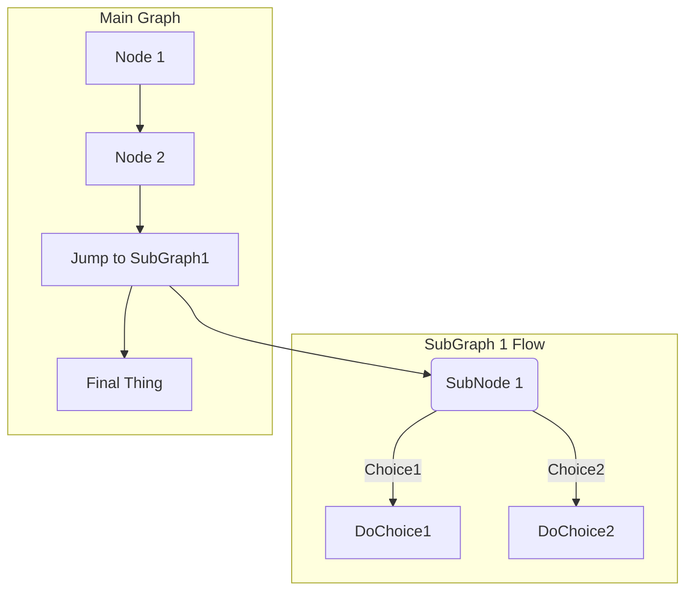

```mermaid 
graph TB 
	SubGraph1 --> SubGraph1Flow 
	subgraph "SubGraph 1 Flow" 
	SubGraph1Flow(SubNode 1) 
	SubGraph1Flow -- Choice1 --> DoChoice1 
	SubGraph1Flow -- Choice2 --> DoChoice2 
	end 

	subgraph "Main Graph" 
	Node1[Node 1] --> Node2[Node 2] 
	Node2 --> SubGraph1[Jump to SubGraph1] 
	SubGraph1 --> FinalThing[Final Thing] 
end  
```
<!--stackedit_data:
eyJoaXN0b3J5IjpbMTE0MjU1ODI1MCw5MTI5MTQzOTMsLTExMj
E2NDExMDUsNjM3NzY4NzI3XX0=
-->